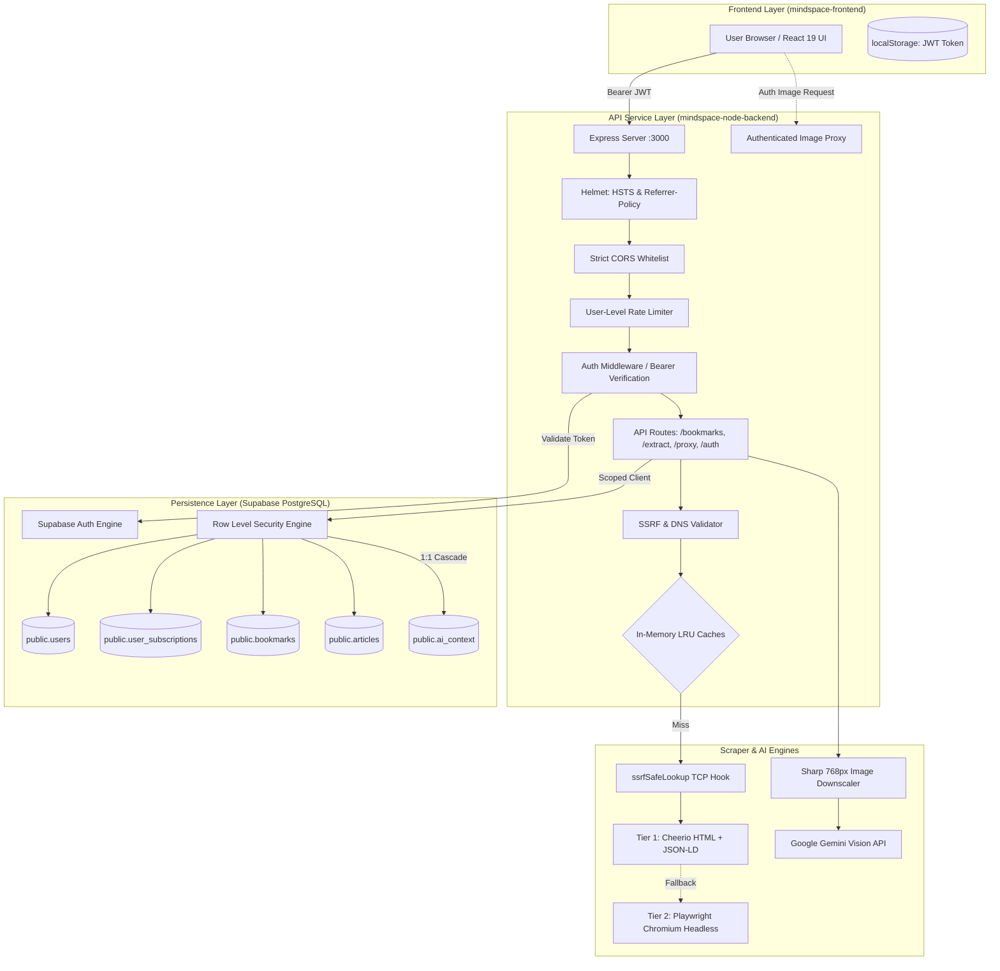
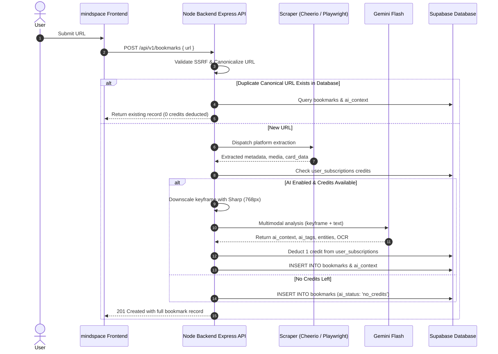
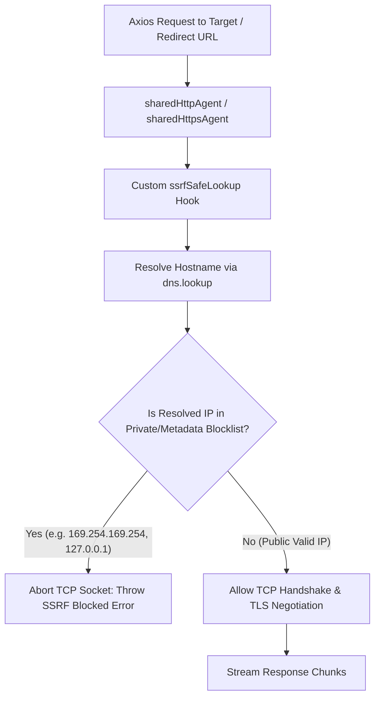

# Mindspace Node Backend — Comprehensive Technical Documentation (`DETAILS.md`)

A stateless, high-performance **REST API** built with **Node.js**, **Express**, **TypeScript**, **Cheerio**, **Playwright**, and **Google Gemini Multimodal Vision API** (`@google/genai`).

The service provides automated metadata extraction, media capture, anti-scraping and CDN hotlinking bypasses, user authentication, subscription quota gating, enterprise SSRF protection, socket-level connection security, and deep multimodal visual intelligence on bookmarked links for **Mindspace**.

---

## Table of Contents

1. [System Architecture](#system-architecture)
2. [Complete Implementation History](#complete-implementation-history)
   - [1. Authentication, Sessions & RLS](#1-authentication-sessions--rls)
   - [2. Dual-Engine Scraping Pipeline](#2-dual-engine-scraping-pipeline)
   - [3. Platform-Specific Extractors](#3-platform-specific-extractors)
   - [4. Multimodal AI Visual & Video Intelligence](#4-multimodal-ai-visual--video-intelligence)
   - [5. Subscription Credit Quota & User Rate Limits](#5-subscription-credit-quota--user-rate-limits)
   - [6. High-Performance In-Memory LRU Caching](#6-high-performance-in-memory-lru-caching)
   - [7. Global TCP Connection Pooling with Socket-Level SSRF Guards](#7-global-tcp-connection-pooling-with-socket-level-ssrf-guards)
   - [8. Authenticated Streaming Reverse Image Proxy Engine](#8-authenticated-streaming-reverse-image-proxy-engine)
   - [9. Comprehensive SSRF Defense & DNS Rebinding Mitigation](#9-comprehensive-ssrf-defense--dns-rebinding-mitigation)
   - [10. HTTP Security Headers, CORS Lockdown & Error Sanitization](#10-http-security-headers-cors-lockdown--error-sanitization)
3. [Mermaid Architecture & Data Flow Diagrams](#mermaid-architecture--data-flow-diagrams)
   - [End-to-End System Topology](#end-to-end-system-topology)
   - [Bookmark Extraction & Multimodal AI Sequence](#bookmark-extraction--multimodal-ai-sequence)
   - [Socket-Level SSRF Pre-Connect Interception](#socket-level-ssrf-pre-connect-interception)
4. [API Endpoints Reference](#api-endpoints-reference)
5. [Database Schema & Supabase Setup (`schema.sql`)](#database-schema--supabase-setup-schemasql)
6. [Project Structure](#project-structure)
7. [Environment Setup](#environment-setup)
8. [Commands & Scripts](#commands--scripts)

---

## System Architecture

Mindspace Backend is engineered around three core pillars: **Speed**, **Resilience**, and **Zero-Trust Security**:

- **Fast-Path Metadata Extraction**: Lightweight static HTML ingestion via Axios & Cheerio (<150ms) before falling back to headless Chromium through Playwright (<2s).
- **Tenant Isolation with Supabase RLS**: All user data operations are bound to the caller's JWT token via `getAuthenticatedSupabaseClient(token)`, ensuring PostgreSQL strictly enforces `auth.uid() = user_id`.
- **Multimodal AI Vision Intelligence**: Google Gemini 2.5 / 3.x Flash models analyze downscaled keyframes, audio tracks, and full article prose to synthesize contextual summaries, OCR text, and AI tags.
- **Multi-Layer SSRF & Rebinding Defenses**: Validates hostnames ahead of time, maintains an IP-revalidating DNS cache, aborts internal Playwright subresources, and inspects resolved IPs at the raw TCP socket level (`ssrfSafeLookup`) before connecting.

---

## Complete Implementation History

### 1. Authentication, Sessions & RLS
- **Supabase Auth Gateway (`src/controllers/authController.ts`, `src/middleware/authMiddleware.ts`)**:
  - `POST /api/v1/auth/signup`: Registers new users in Supabase Auth.
    - **Password Complexity**: Enforces `PASSWORD_REGEX = /^(?=.*[a-z])(?=.*[A-Z])(?=.*\d).{8,}$/` (requires uppercase, lowercase, and digit; minimum 8 chars).
    - **User Enumeration Defense**: Returns a generic `'Unable to create account. Please check your details and try again.'` message on failure instead of leaking `"User already registered"`.
  - `POST /api/v1/auth/login`: Authenticates user credentials. Returns generic `"Invalid email or password"` error (CWE-204) regardless of whether email exists.
  - `POST /api/v1/auth/refresh`: Exchanges valid refresh tokens for new access tokens.
  - `POST /api/v1/auth/forgot-password`: Triggers password reset email with constant generic response to prevent account enumeration.
  - `GET /api/v1/auth/me`: Validates caller's Bearer token and returns active profile.
- **Bearer Token Middleware (`src/middleware/authMiddleware.ts`)**:
  - Validates tokens using `supabaseAdmin.auth.getUser(token)`.
  - Injects authenticated user object and a scoped Supabase client (`req.supabase`) directly into the request context.

### 2. Dual-Engine Scraping Pipeline
- **Tier 1 — Cheerio Scraper (`src/services/cheerioScraper.ts`)**:
  - Fetches static HTML in **<150ms** with custom desktop browser and crawler user-agents.
  - Parses OpenGraph (`og:*`), Twitter Cards (`twitter:*`), Schema.org JSON-LD, HTML5 semantic headings, meta descriptions, and touch icons.
  - **Full Article Extraction (`extractArticleContent`)**: Intelligently locates main article bodies (`article`, `[itemprop="articleBody"]`, `.post-content`, `main`), strips noise (ads, comments, sidebars), and outputs formatted Markdown with word counts and reading time.
- **Tier 2 — Playwright Chromium Headless Engine (`src/services/playwrightEngine.ts`)**:
  - Singleton browser instance with automatic recovery on crash or disconnect.
  - **Aggressive Resource Blocking**: Aborts stylesheets, fonts, images, media, websockets, and tracking scripts (Google Analytics, Hotjar, GTM, Clarity).
  - **SSRF Subresource Route Isolation**: Intercepts `page.route('**/*')` and aborts any subresource requests attempting to contact private/internal IP addresses, localhost, or cloud metadata services (`169.254.169.254`).

### 3. Platform-Specific Extractors
Each supported platform has a dedicated extractor strategy implementing `PlatformExtractor` (`src/services/extractors/`):

| Platform | File | Features Implemented |
| :--- | :--- | :--- |
| **Facebook** | `facebook.ts` | Mobile endpoints, crawler headers, Lookaside CDN resolver (`lookaside.fbsbx.com` -> `scontent.*.fbcdn.net`), post captions, multi-image carousel items, and parsed engagement metrics. |
| **Instagram** | `instagram.ts` | Parses Instagram embed HTML and structured JSON payloads, extracts clean captions, direct `.mp4` video streams, multi-image carousel sets, and author profile details. |
| **LinkedIn** | `linkedin.ts` | Scrapes LinkedIn JSON-LD metadata, filters generic ghost avatars, extracts post text, author headlines, article bodies, and reaction counts. |
| **Twitter / X** | `twitter.ts` | Multi-tier pipeline: FxTwitter API (`api.fxtwitter.com`), VxTwitter API, oEmbed syndication, and Playwright fallback for tweet text, media galleries, and metrics. |
| **Reddit** | `reddit.ts` | Queries Reddit JSON endpoints (`.json`), parses gallery data, video audio/playback streams, subreddit icons, author badges, and upvote metrics. |
| **YouTube** | `youtube.ts` | Extracts video IDs from standard URLs, shortlinks (`youtu.be`), embeds, and Shorts; queries YouTubei and oEmbed APIs for channel metadata, views, likes, and thumbnails. |
| **Global Web** | `globalWeb.ts` | Universal fallback for blogs, docs, and news sites with Google S2 favicon resolution, page intent classification, and article extraction. |

### 4. Multimodal AI Visual & Video Intelligence (`src/services/aiVisualService.ts`)
- **Powered by Google Gemini Multimodal Vision API (`@google/genai`)**:
  - Automatically submits media attachments and contextual metadata to Google's next-generation multimodal models.
  - **Candidate Model Chain & Circuit Breaker**:
    ```
    gemini-3.5-flash-lite → gemini-3.1-flash-lite → gemini-3.8-flash → gemini-3.7-flash → gemini-3.6-flash → gemini-3.5-flash
    ```
  - **In-Memory Quota Circuit Breaker (`exhaustedModels`)**:
    - If a model encounters quota exhaustion (`limit: 20`, `GenerateRequestsPerDay`, `RESOURCE_EXHAUSTED`, `quota exceeded`, `429`), it is added to `exhaustedModels` and instantly bypassed in future requests.
  - **Per-Model Fast Timeout (`AI_MODEL_TIMEOUT_MS`)**: Configurable timeout (default: `7000ms`). Stalled models abort and trigger immediate failover to the next candidate.
- **Ultra-Efficient In-Memory Image Compression (`sharp`)**:
  - **Single-Tile Optimization (Max 768px)**: Resizes candidate images to fit within 768×768 (Gemini's native single tile size) and converts to progressive JPEG (quality 70%).
  - **Drastic Payload Reduction**: Decreases base64 payloads from multi-MBs down to **20KB–50KB** (a **78% to 98% reduction**) while retaining crisp clarity for entity recognition and OCR.
- **Lightweight Video & Reel Processing (Keyframe + Text)**:
  - Extracts poster keyframes and pairs them with post captions and transcripts in under **1.5 seconds** at ~258 tokens instead of downloading heavy 15MB video files.
- **Anti-Hallucination Guardrails**:
  - Bypasses Gemini when login walls are detected (e.g. private Instagram/Facebook posts), returning clean fallback tags instead of consuming token quotas.

### 5. Subscription Credit Quota & User Rate Limits (`src/services/subscriptionService.ts`, `src/middleware/rateLimiter.ts`)
- **Tier Quota Management**:
  - `free`: 6 AI credits per period with automatic weekly reset.
  - `pro`: Unlimited AI context generation.
- **Atomic Credit Deduction**:
  - `deductOneAiCredit()` is executed **only after** Gemini successfully generates a response, guaranteeing users are never billed for failed attempts or cached responses.
- **User-Level Rate Limiting**:
  - `authRateLimiter`: 5 attempts per 15 minutes per IP (login, signup, reset).
  - `apiRateLimiter`: 300 requests per 15 minutes keyed by authenticated user ID (`userOrIpKey`), falling back to IP.
  - `heavyScrapingRateLimiter`: 20 requests per minute keyed by user ID (`userOrIpKey`) on `/extract`, `/ai-analyze`, and `/proxy-image`.

### 6. High-Performance In-Memory LRU Caching (`src/utils/cache.ts`, `src/utils/urlFormatter.ts`)
- **Deterministic Canonicalization**:
  - Normalizes tracking query parameters (`utm_*`, `stkn`, `igsh`, `fbclid`, `gclid`, `s=20`, `si`), path variations (`/reels/` vs `/reel/`), and hostnames.
- **Zero-Dependency LRU Cache Instances**:
  - `extractionCache`: 30-minute TTL (1,000 entries) for sub-millisecond repeated URL extractions.
  - `aiCache`: 1-hour TTL (500 entries) for multimodal Gemini analyses.
  - `avatarCache`: 2-hour TTL (500 entries) for external author/channel avatars.
  - `dnsCache`: 5-minute TTL (500 entries) storing resolved IP strings for SSRF re-validation.

### 7. Global TCP Connection Pooling with Socket-Level SSRF Guards (`src/utils/httpClient.ts`)
- Shared `http.Agent` and `https.Agent` configured with `keepAlive: true`, 64 max sockets, and 32 free sockets globally bound to Axios.
- **Socket-Level SSRF Interceptor (`ssrfSafeLookup`)**:
  - Intercepts DNS resolution immediately prior to TCP socket establishment.
  - Validates every resolved IP address against the private IP blocklist.
  - Throws `SSRF blocked` if a domain resolves or redirects to internal/private IPs (`127.0.0.1`, `169.254.169.254`, `10.x.x.x`, etc.).
  - Guarantees complete defense against DNS rebinding (TTL 0) and HTTP 302 redirect TOCTOU attacks across all Axios extractors.

### 8. Authenticated Streaming Reverse Image Proxy Engine (`src/controllers/proxyController.ts` & `src/routes/proxy.ts`)
- Protected by `authMiddleware` to prevent unauthorized open-proxy relay abuse.
- `maxRedirects: 0` with manual redirect loop validation.
- Validates upstream `Content-Type` against strict image allowlist (`image/jpeg`, `image/png`, `image/webp`, `image/gif`). Excludes `image/svg+xml` to eliminate SVG stored XSS.
- Injects `X-Content-Type-Options: nosniff` and `Content-Security-Policy: default-src 'none'`.
- Pipes upstream image chunks directly to the response with client disconnect abort hooks.

### 9. Comprehensive SSRF Defense & DNS Rebinding Mitigation (`src/utils/ssrfValidator.ts`, `src/utils/cache.ts`)
- Target hostnames resolved and validated prior to request dispatch.
- Blocks internal, loopback, private, and link-local ranges:
  - `127.0.0.0/8` (Loopback)
  - `10.0.0.0/8`, `172.16.0.0/12`, `192.168.0.0/16` (Private RFC 1918)
  - `169.254.0.0/16` (Link-Local & Cloud Metadata e.g. AWS/GCP `169.254.169.254`)
  - `0.0.0.0/8` (Current network)
  - `::1`, `fc00::/7`, `fe80::/10` (IPv6 loopback & private)
- Rejects `localhost`, `.local`, and `.internal` hostnames.
- `dnsCache` stores IP strings (`MemoryCache<string>`); every cache hit is re-validated against `isPrivateIP()` to prevent stale whitelist windows.

### 10. HTTP Security Headers, CORS Lockdown & Error Sanitization
- **Strict CORS Policy (`src/index.ts`)**: Wildcards (`*.vercel.app`, `*.onrender.com`) removed. Restricted strictly to `https://mindspace.vercel.app`, preview deployments matching `/^https:\/\/mindspace(-[a-z0-9-]+)?\.vercel\.app$/`, and the production backend origin.
- **Helmet HTTP Security Headers (`src/index.ts`)**:
  - HSTS enabled with 2-year `maxAge: 63072000`, `includeSubDomains: true`, and `preload: true`.
  - `Referrer-Policy: strict-origin-when-cross-origin`.
  - `x-powered-by` disabled.
- **Internal Error Sanitization**:
  - Sanitized all 500 error responses in `bookmarkController.ts`, `extractController.ts`, and `aiController.ts`.
  - Raw exception details (`error.message`, `bmError?.message`) are stripped from client payloads and logged server-side only via `logger.error()`.
- **Admin Key Warning Severity**: Missing `SUPABASE_SERVICE_ROLE_KEY` upgraded from `warn` to `error` in `supabaseClient.ts`.

---

## Mermaid Architecture & Data Flow Diagrams

### End-to-End System Topology



### Bookmark Extraction & Multimodal AI Sequence



### Socket-Level SSRF Pre-Connect Interception



---

## API Endpoints Reference

### Authentication Endpoints

- **`POST /api/v1/auth/signup`**: Registers user in Supabase Auth with password complexity enforcement.
  - Body: `{ "email": "user@example.com", "password": "SecurePassword1!", "username": "abhi" }`
- **`POST /api/v1/auth/login`**: Authenticates credentials with generic error messages.
  - Body: `{ "email": "user@example.com", "password": "SecurePassword1!" }`
- **`POST /api/v1/auth/refresh`**: Exchanges refresh token for new access token.
  - Body: `{ "refreshToken": "..." }`
- **`POST /api/v1/auth/forgot-password`**: Triggers reset email without user enumeration.
  - Body: `{ "email": "user@example.com" }`
- **`GET /api/v1/auth/me`**: Returns profile of authenticated caller.
  - Headers: `Authorization: Bearer <token>`

### Bookmark Endpoints (Authenticated)

- **`GET /api/v1/bookmarks`**: Lists all bookmarks for the authenticated user, joined with AI context.
- **`POST /api/v1/bookmarks`**: Creates bookmark, scrapes metadata, checks credits, runs Gemini AI, and persists to Supabase.
  - Body: `{ "url": "https://...", "auto_ai_context": true }`
- **`POST /api/v1/bookmarks/:id/generate-ai`**: Triggers manual AI context generation for existing bookmark.
- **`GET /api/v1/bookmarks/:id/article`**: Returns Reader Mode full article content.
- **`DELETE /api/v1/bookmarks/:id`**: Removes bookmark and cascades deletion.

### User & Quota Endpoints (Authenticated)

- **`GET /api/v1/user/plan`**: Returns current plan tier (`free` / `pro`) and remaining AI credits.
- **`PATCH /api/v1/user/settings`**: Updates preferences (e.g. `{ "auto_ai_context": false }`).

### Utility Endpoints

- **`POST /api/v1/extract`**: Protected extraction endpoint with `heavyScrapingRateLimiter`.
- **`POST /api/v1/ai-analyze`**: Protected standalone visual intelligence endpoint.
- **`GET /api/v1/proxy-image?url=ENCODED_IMAGE_URL`**: Protected reverse image proxy with `authMiddleware`.
- **`GET /health`**: Health status and ISO timestamp.

---

## Database Schema & Supabase Setup (`schema.sql`)

The repository includes a complete PostgreSQL schema script in [`schema.sql`](file:///c:/Users/abhi/Documents/mindspace/mindspace-node-backend/schema.sql) ready to be executed in the **Supabase SQL Editor**:

1. Open your project on the [Supabase Dashboard](https://supabase.com/dashboard).
2. Navigate to the **SQL Editor** tab on the left sidebar.
3. Copy the entire contents of [`schema.sql`](file:///c:/Users/abhi/Documents/mindspace/mindspace-node-backend/schema.sql).
4. Paste it into the editor and click **Run**.

---

## Project Structure

```
mindspace-node-backend/
├── src/
│   ├── controllers/
│   │   ├── aiController.ts         # Controller for /api/v1/ai-analyze (generic 500)
│   │   ├── authController.ts       # Controller for auth routes (password regex, generic errors)
│   │   ├── bookmarkController.ts   # Controller for bookmarks & reader article (generic 500s)
│   │   ├── extractController.ts    # Controller for /api/v1/extract (generic 500)
│   │   └── proxyController.ts      # Controller for /api/v1/proxy-image (streaming proxy)
│   ├── middleware/
│   │   ├── authMiddleware.ts       # Bearer token validator & RLS client injector
│   │   └── rateLimiter.ts          # Auth, general API, and heavy scraping rate limiters
│   ├── routes/
│   │   ├── auth.ts                 # Authentication routes
│   │   ├── bookmarks.ts            # Bookmark CRUD and user plan routes
│   │   ├── extract.ts              # Extraction & AI routes
│   │   └── proxy.ts                # Image proxy route (protected with authMiddleware)
│   ├── services/
│   │   ├── extractors/             # Strategy extractors for Facebook, Instagram, LinkedIn, Reddit, Twitter, YouTube, Global Web
│   │   ├── aiVisualService.ts      # Multimodal Gemini vision & fallback service
│   │   ├── cheerioScraper.ts       # Fast static HTML & Markdown article scraper
│   │   ├── playwrightEngine.ts     # Chromium browser manager with route isolation
│   │   └── subscriptionService.ts  # Tier credit allocation & quota deduction
│   ├── utils/
│   │   ├── cache.ts                # In-memory LRU caches (extraction, AI, avatar, dnsCache: string)
│   │   ├── httpClient.ts           # TCP Keep-Alive pooling with ssrfSafeLookup socket guard
│   │   ├── logger.ts               # Structured timestamped logger
│   │   ├── numberParser.ts         # Formatted number parser
│   │   ├── siteName.ts             # Domain & site name resolver
│   │   ├── ssrfValidator.ts        # SSRF IP validation & isPrivateIP export
│   │   ├── supabaseClient.ts       # Supabase admin and RLS client factories
│   │   ├── textCleaner.ts          # HTML entity & whitespace cleaner
│   │   └── urlFormatter.ts         # Absolute URL resolver & canonicalizer
│   └── index.ts                    # Express app with HSTS, Referrer-Policy, tight CORS
├── schema.sql                      # PostgreSQL database schema & RLS policies
├── package.json
├── tsconfig.json
└── .env.example
```

---

## Environment Setup

Create a `.env` file in `mindspace-node-backend/`:

```env
PORT=3000

# Google Gemini Multimodal Vision API Key
GEMINI_API_KEY=your_gemini_api_key_here
ENABLE_AI_VISUAL=true
AI_MODEL_TIMEOUT_MS=7000

# Supabase Configuration
SUPABASE_URL=https://your-project.supabase.co
SUPABASE_SERVICE_ROLE_KEY=your-service-role-key-here
SUPABASE_ANON_KEY=your-anon-key-here

# Allowed Origins (optional extra domains)
ALLOWED_ORIGINS=https://mindspace.vercel.app

# Logging
LOG_LEVEL=info
```

---

## Commands & Scripts

### Installation
```bash
npm install
npx playwright install chromium
```

### Development Server
```bash
npm run dev
```

### Type Checking & Build
```bash
npx tsc --noEmit
npm run build
```

### Production Server
```bash
npm start
```
