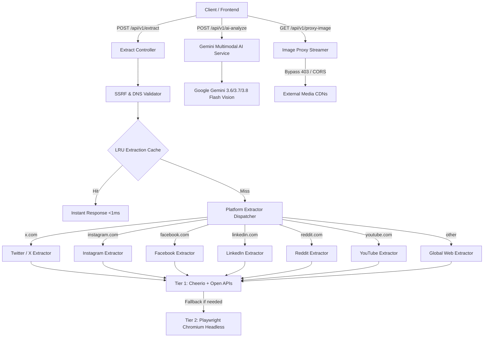

# mindspace Node Backend (`mindspace-node-backend`)

A stateless, high-performance **REST API** built with **Node.js**, **Express**, **TypeScript**, **Cheerio**, **Playwright**, and **Google Gemini Multimodal Vision API** (`@google/genai`).

The service extracts rich metadata, captures media snapshots, bypasses complex anti-scraping and CDN hotlinking protections, and performs deep multimodal visual/video intelligence on bookmarked links.

---

## Table of Contents

1. [System Architecture](#system-architecture)
2. [What Has Been Done Until Now](#what-has-been-done-until-now)
   - [1. Dual-Engine Scraping Pipeline](#1-dual-engine-scraping-pipeline)
   - [2. Platform-Specific Extractors](#2-platform-specific-extractors)
   - [3. Multimodal AI Visual & Video Intelligence](#3-multimodal-ai-visual--video-intelligence)
   - [4. High-Performance In-Memory LRU Caching](#4-high-performance-in-memory-lru-caching)
   - [5. Global TCP Connection Pooling](#5-global-tcp-connection-pooling)
   - [6. Reverse Image Proxy Engine](#6-reverse-image-proxy-engine)
   - [7. Enterprise SSRF Protection & DNS Validation](#7-enterprise-ssrf-protection--dns-validation)
3. [API Endpoints Reference](#api-endpoints-reference)
4. [Project Structure](#project-structure)
5. [Database Schema & Supabase Setup (`schema.sql`)](#database-schema--supabase-setup-schemasql)
6. [Environment Setup](#environment-setup)
7. [Commands & Scripts](#commands--scripts)

---

## System Architecture



---

## What Has Been Done Until Now

### 1. Dual-Engine Scraping Pipeline
- **Tier 1 — Ultra-Fast Cheerio Scraper (`src/services/cheerioScraper.ts`)**:
  - Fetches static HTML in **<150ms** with custom desktop browser user-agents.
  - Parses OpenGraph (`og:*`), Twitter Cards (`twitter:*`), Schema.org JSON-LD, HTML5 semantic headings, meta descriptions, and touch icons.
- **Tier 2 — Playwright Chromium Headless Engine (`src/services/playwrightEngine.ts`)**:
  - Singleton browser instance with automatic recovery on crash or disconnect.
  - **Aggressive Resource Blocking**: Aborts stylesheets, fonts, images, media, websockets, and tracking scripts (Google Analytics, Hotjar, GTM, Clarity) directly at the network routing layer to maximize rendering speed and minimize RAM footprint.
  - Custom evaluation hooks, strict hydration timeouts (`domcontentloaded`), and clean process termination handlers (`SIGINT`, `SIGTERM`).

### 2. Platform-Specific Extractors
Each platform has a dedicated extractor strategy implementing the `PlatformExtractor` interface (`src/services/extractors/`):

- **Facebook (`facebook.ts`)**:
  - Multi-tier strategy targeting mobile endpoints (`m.facebook.com`, `touch.facebook.com`) and crawler user-agents (`facebookexternalhit/1.1`).
  - **Lookaside CDN Resolver**: Automatically converts restricted `lookaside.fbsbx.com/lookaside/crawler/media` URLs into direct `scontent.*.fbcdn.net` URLs that display reliably in browsers.
  - Extracts post caption, author name, timestamp, multi-image carousel items, and parsed engagement metrics (likes, comments, shares, multilingual view strings).
- **Instagram (`instagram.ts`)**:
  - Parses Instagram embed HTML and structured JSON payloads.
  - Extracts clean captions (stripping date prefixes and comment counters), direct `.mp4` video URLs, multi-image carousel sets, and author profile details.
- **LinkedIn (`linkedin.ts`)**:
  - Scrapes LinkedIn JSON-LD metadata and OpenGraph tags.
  - Filters out generic avatars (`isGhostAvatar`) and company placeholder badges.
  - Extracts post text, author name (including fallback to post URL slug formatting), media galleries, and engagement counts (reactions, comments, reposts).
- **Twitter / X (`twitter.ts`)**:
  - Integrates with the **FxTwitter API** (`api.fxtwitter.com`) for sub-200ms JSON data retrieval.
  - Extracts tweet text, verified author credentials, handle, photo galleries, video playback/thumbnails, reply/repost/like/view counts.
  - Fallback chain: FxTwitter API → Cheerio syndication/oEmbed → Playwright evaluation.
- **Reddit (`reddit.ts`)**:
  - Queries Reddit JSON endpoints (`.json`) with customized user-agent headers.
  - Extracts post title, self-text preview, subreddit icon, author username, upvote and comment counters, video previews, and image galleries.
- **YouTube (`youtube.ts`)**:
  - Extracts video IDs from standard URLs, shortlinks (`youtu.be`), embeds, and Shorts.
  - Fetches channel name, subscriber count, avatar, view count, like count, and high-definition video thumbnails via oEmbed and channel scrapers.
- **Global Web (`globalWeb.ts`)**:
  - Universal fallback for blogs and news sites.
  - Resolves favicon via Google S2 service (`https://www.google.com/s2/favicons?domain=...&sz=128`), resolves relative URLs to absolute links, and extracts clean meta titles and descriptions.

### 3. Multimodal AI Visual & Video Intelligence (`src/services/aiVisualService.ts`)
- **Powered by Google Gemini Multimodal Vision API (`@google/genai`)**:
  - Automatically submits media attachments and contextual metadata to Google's next-generation multimodal models.
  - **Candidate Model Priority & 500 RPD Optimization**:
    - Prioritizes high-quota **500 Requests Per Day (RPD)** Flash Lite models before falling back to 20 RPD flagship models:
      ```
      gemini-3.5-flash-lite → gemini-3.1-flash-lite → gemini-3.8-flash → gemini-3.7-flash → gemini-3.6-flash → gemini-3.5-flash
      ```
  - **In-Memory Quota Circuit Breaker (`exhaustedModels`)**:
    - Module-level `exhaustedModels = new Set<string>()` tracks rate-limited models across requests.
    - If a model encounters a quota exhaustion error (`limit: 20`, `GenerateRequestsPerDay`, `RESOURCE_EXHAUSTED`, `quota exceeded`, `429`), it is added to `exhaustedModels` and instantly bypassed in future requests without wasting network roundtrips.
  - **Per-Model Fast Timeout (`AI_MODEL_TIMEOUT_MS`)**: Wraps each generation in a configurable timeout promise (default: `7000ms` / 7s). If a model stalls or is throttled, the request aborts after 7s and instantly falls over to the next candidate model in the chain.
- **"All-in-One" Social Media Multimodal Pipeline**:
  - **Platform Detection (`detectSocialPlatform`)**: Automatically identifies posts from Twitter / X, Instagram, LinkedIn, and Reddit.
  - **Audio & Video Poster Keyframe Co-Analysis**:
    - Downloads available post audio (`card_data.audio` or audio streams from `card_data.media`) alongside Sharp-compressed keyframe images.
    - Sends both audio and visual inputs as `inlineData` parts in a single unified Gemini request.
    - Instructs Gemini to transcribe spoken dialogue and voiceovers, correlate them with visual context, and synthesize the unified insights into `ai_context` and auto-generated tags.
- **Ultra-Efficient In-Memory Image Compression (`sharp`)**:
  - **Single-Tile Optimization (Max 768px)**: Gemini parses visual inputs in 768×768 pixel tiles (~258 tokens per tile). Raw smartphone/camera photos (e.g., 4000×3000px) get split into 12–16 tiles, consuming 3,000+ tokens and megabytes of bandwidth.
  - Using `sharp`, every candidate image is downscaled to fit within a 768×768 bounding box and converted to progressive JPEG (quality 70%).
  - **Drastic Payload Reduction**: Decreases base64 payloads from multi-MBs down to **20KB–50KB** (a **78% to 98% reduction**) while retaining crisp clarity for entity recognition, logo detection, and OCR.
  - Guaranteed token cap: Exactly 1 tile (~258 tokens) per image, capped at top 2 images max (~516 tokens total).
- **Lightweight Video & Reel Processing (Keyframe + Transcript)**:
  - Eliminates slow, quota-heavy downloads and uploads of raw 15MB `.mp4` video blobs (which previously consumed 8,000–12,000+ tokens and 10–20 seconds per video).
  - Instead, the engine identifies video posts and extracts the **video poster thumbnail keyframe** (compressed via Sharp) and pairs it with the post's **rich caption, description, and transcript text**.
  - Provides Gemini with full visual and contextual understanding in under **1.5 seconds** at a fraction of the cost (~258 tokens).
- **Anti-Hallucination Guardrails**:
  - Specifically designed to prevent hallucinating fictional TV shows, actors, or events when links lead to login walls (e.g. private Instagram/Facebook posts).
  - Skips AI generation on detected login walls, returning clean fallback tags instead of consuming token quotas.
- **Output Schema**:
  - Generates a synthesized 2–4 sentence contextual summary (`ai_context`), an array of lowercase tags (`ai_tags`), extracted visual entities (`visual_entities`), and on-screen OCR text (`ocr_text`).
- **Heuristic Fallback**:
  - Operates non-blockingly; if `GEMINI_API_KEY` is not configured or all models fail, the service seamlessly falls back to keyword-based heuristic tagging without throwing errors.

### 4. High-Performance In-Memory LRU Caching & Canonical URL Normalization (`src/utils/cache.ts`, `src/utils/urlFormatter.ts`)
- **Canonical URL Normalization (`src/utils/urlFormatter.ts`)**:
  - Deterministically canonicalizes URLs before caching or fetching to guarantee instant cache hits across link variations:
    - **Instagram**: Unifies `/reels/<id>` and `/reel/<id>`, strips noisy share tokens and tracking parameters (`?utm_source=...`, `&stkn=...`, `&igsh=...`, `&igshid=...`). Both direct browser URL bar copies and "Share -> Copy link" URLs resolve to the exact same canonical key: `https://www.instagram.com/reel/<id>/`.
    - **Twitter / X**: Unifies `twitter.com`, `mobile.twitter.com`, and `x.com` to `https://x.com/<user>/status/<id>` and strips tracking params (`?s=20`, `&t=...`, `&ref_src=...`).
    - **YouTube**: Unifies `youtu.be/<id>`, `youtube.com/shorts/<id>`, and `youtube.com/watch?v=<id>` while stripping `si`, `feature`, and `pp` tracking params.
    - **Reddit / Facebook / Web**: Normalizes subreddits/posts, strips `fbclid`, `gclid`, `mibextid`, `ref`, and all standard `utm_*` marketing tags.
- **Controller-Level Full Response Caching**:
  - Caches the complete extracted response (including `card_data`, `ai_context`, `ai_tags`, `visual_entities`, and `ocr_text`) under the canonical URL key.
  - Subsequent requests for the same post—regardless of whether copied from the browser URL bar or generated via a mobile share link—hit the cache and return in **<1ms** without touching scrapers or consuming Gemini tokens.
- **Zero-Dependency LRU Cache Instances (`src/utils/cache.ts`)**:
  - **`extractionCache`**: 30-minute TTL (1,000 entries) for sub-millisecond responses on repeated URL extractions.
  - **`aiCache`**: 1-hour TTL (500 entries) for multimodal Gemini analyses keyed deterministically by canonical URL and title.
  - **`avatarCache`**: 2-hour TTL (500 entries) for external author and channel avatars.
  - **`dnsCache`**: 5-minute TTL (500 entries) for validated SSRF IP resolutions.

### 5. Global TCP Connection Pooling (`src/utils/httpClient.ts`)
- Configured shared `http.Agent` and `https.Agent` with `keepAlive: true`, 64 max sockets, and 32 free sockets globally bound to Axios.
- Reuses established TCP/TLS connections across consecutive requests, eliminating **50–150ms** of SSL handshake latency per scrape.

### 6. Reverse Image Proxy Engine (`src/controllers/proxyController.ts` & `/api/v1/proxy-image`)
- Proxies media requests using a crawler user-agent (`facebookexternalhit/1.1`) to bypass CDN hotlinking blocks and CORS restrictions (especially Meta CDN `fbcdn.net` / `scontent` 403 Forbidden errors).
- **Streaming Pipeline**: Pipes upstream image chunks directly into the client response without loading full files into server memory.
- **Caching Headers**: Injects `Cache-Control: public, max-age=86400, stale-while-revalidate=604800` to allow browser and CDN caching.
- **Client Disconnect Handling**: Destroys upstream streams immediately if the client aborts or unmounts the component.

### 7. Enterprise SSRF Protection & DNS Validation (`src/utils/ssrfValidator.ts`)
- Strict defense against Server-Side Request Forgery (SSRF):
  - Resolves target hostnames before sending requests.
  - Blocks all internal, loopback, private, and link-local ranges:
    - `127.0.0.0/8` (Loopback)
    - `10.0.0.0/8`, `172.16.0.0/12`, `192.168.0.0/16` (Private RFC 1918)
    - `169.254.0.0/16` (Link-Local & Cloud Metadata e.g. AWS/GCP `169.254.169.254`)
    - `0.0.0.0/8` (Current network)
    - `::1`, `fc00::/7`, `fe80::/10` (IPv6 loopback & private)
  - Rejects `localhost`, `.local`, and `.internal` hostnames.
  - Validated hostnames are cached in `dnsCache` to eliminate DNS threadpool bottlenecks.

---

## API Endpoints Reference

### 1. Extract URL Metadata
**`POST /api/v1/extract`**

Extracts metadata, media, platform card data, and basic tags for a given URL.

- **Request Body**:
  ```json
  {
    "url": "https://x.com/username/status/1234567890",
    "forceRefresh": false
  }
  ```
- **Response (`200 OK`)**:
  ```json
  {
    "type": "x",
    "url": "https://x.com/username/status/1234567890",
    "title": "Author Name (@handle) on X",
    "description": "Tweet text...",
    "logo": "https://abs.twimg.com/favicons/twitter.3.ico",
    "site_name": "Twitter / X",
    "card_data": {
      "author": {
        "name": "Author Name",
        "handle": "@handle",
        "avatar_url": "https://pbs.twimg.com/profile_images/...",
        "verified": true
      },
      "metrics": {
        "replies": 12,
        "reposts": 45,
        "likes": 230,
        "views": 1500
      },
      "media": [
        { "type": "image", "url": "https://pbs.twimg.com/media/..." }
      ],
      "posted_at": "2026-09-08T10:00:00.000Z"
    },
    "ai_context": null,
    "ai_tags": [],
    "cached": true
  }
  ```

### 2. Standalone Multimodal AI Analysis
**`POST /api/v1/ai-analyze`**

Runs deep multimodal Gemini vision analysis on an existing bookmark or media asset.

- **Request Body**:
  ```json
  {
    "url": "https://example.com/post",
    "title": "Post Title",
    "description": "Post Description",
    "snapshot": "https://example.com/image.jpg",
    "site_name": "Platform"
  }
  ```
- **Response (`200 OK`)**:
  ```json
  {
    "ai_context": "Detailed contextual paragraph synthesizing video/image elements, actors, and spoken topics...",
    "ai_tags": ["technology", "ai", "web-development"],
    "visual_entities": ["Visual Entity 1", "Logo Name"],
    "ocr_text": "Text detected inside media..."
  }
  ```

### 3. Streaming Image Proxy
**`GET /api/v1/proxy-image?url=ENCODED_IMAGE_URL`**

Bypasses hotlinking blocks and returns the image stream with SSRF protection and 24-hour client caching.

### 4. Health Check
**`GET /health`**

Returns service uptime status:
```json
{
  "status": "ok",
  "timestamp": "2026-09-08T16:47:00.000Z"
}
```

---

## Project Structure

```
mindspace-node-backend/
├── src/
│   ├── controllers/
│   │   ├── aiController.ts         # Controller for /api/v1/ai-analyze
│   │   ├── extractController.ts    # Controller for /api/v1/extract
│   │   └── proxyController.ts      # Controller for /api/v1/proxy-image
│   ├── routes/
│   │   ├── extract.ts              # Extraction & AI routes
│   │   └── proxy.ts                # Image proxy route
│   ├── services/
│   │   ├── extractors/
│   │   │   ├── facebook.ts         # Facebook multi-tier extractor
│   │   │   ├── globalWeb.ts        # Generic website fallback extractor
│   │   │   ├── index.ts            # Extractor router & caching dispatcher
│   │   │   ├── instagram.ts        # Instagram embed & JSON extractor
│   │   │   ├── linkedin.ts         # LinkedIn JSON-LD extractor
│   │   │   ├── reddit.ts           # Reddit JSON API extractor
│   │   │   ├── twitter.ts          # Twitter / FxTwitter API extractor
│   │   │   ├── types.ts            # Common extractor TypeScript interfaces
│   │   │   └── youtube.ts          # YouTube oEmbed & channel extractor
│   │   ├── aiVisualService.ts      # Multimodal Gemini vision & fallback service
│   │   ├── cheerioScraper.ts       # Fast static HTML scraper
│   │   └── playwrightEngine.ts     # Chromium headless browser manager
│   ├── utils/
│   │   ├── cache.ts                # In-memory LRU cache implementations
│   │   ├── httpClient.ts           # Axios TCP keep-alive connection pooling
│   │   ├── logger.ts               # Timestamped structured logger
│   │   ├── numberParser.ts         # Formatted numbers parser (e.g. 1.2K -> 1200)
│   │   ├── siteName.ts             # Domain & site name resolver
│   │   ├── ssrfValidator.ts        # SSRF IP resolution defense
│   │   ├── textCleaner.ts          # HTML entity & whitespace cleaner
│   │   └── urlFormatter.ts         # Absolute URL resolver & normalizer
│   └── index.ts                    # Express app initialization & shutdown hooks
├── package.json
├── tsconfig.json
└── .env.example
```

---

## Database Schema & Supabase Setup (`schema.sql`)

The repository includes a complete PostgreSQL schema script in [`schema.sql`](file:///c:/Users/abhi/Documents/mindspace-app/mindspace-node-backend/schema.sql) ready to be executed in the **Supabase SQL Editor**:

### 1. Key Database Changes & Architecture
- **Wiped Off Obsolete Tables**:
  - Legacy `collections`, `tags`, `bookmark_collections`, and `bookmark_tags` tables have been completely dropped.
  - Manual folder and tag creation is eliminated in favor of 100% automated Multimodal AI visual analysis, summary synthesis, and auto-tagging.
- **Dedicated `public.ai_context` Table**:
  - Instead of overloading `public.bookmarks`, AI visual context, auto-generated tags (`ai_tags`), visual entities, and OCR text are stored in a separate table.
  - Keyed by `bookmark_id UUID NOT NULL UNIQUE REFERENCES public.bookmarks(id) ON DELETE CASCADE`.
- **Core Entities**:
  - `public.users`: Synchronized from `auth.users` on sign-up via PostgreSQL trigger.
  - `public.bookmarks`: Core link metadata, snapshots, favicons, site names, and platform-specific `card_data`.
  - `public.ai_context`: Multimodal AI visual descriptions, OCR text, and auto-generated tags.
- **Security & RLS**:
  - Strict Row Level Security (RLS) policies enabled across all tables guaranteeing complete data isolation per `auth.uid() = user_id`.

### 2. How to Apply
1. Open your project on the [Supabase Dashboard](https://supabase.com/dashboard).
2. Navigate to the **SQL Editor** tab on the left sidebar.
3. Copy the entire contents of [`mindspace-node-backend/schema.sql`](file:///c:/Users/abhi/Documents/mindspace-app/mindspace-node-backend/schema.sql).
4. Paste it into the editor and click **Run**.


## Environment Setup

Create a `.env` file in `mindspace-node-backend/` based on `.env.example`:

```env
PORT=3000
GEMINI_API_KEY=AIzaSy...
ENABLE_AI_VISUAL=true
AI_MODEL_TIMEOUT_MS=7000
```

### Obtaining a Google Gemini API Key
1. Visit [Google AI Studio](https://aistudio.google.com).
2. Sign in with your Google account.
3. Click **"Get API Key"** and generate a new key (free tier available).
4. Paste the key into your `.env` file as `GEMINI_API_KEY`.

---

## Commands & Scripts

### Prerequisites
- Node.js (v18+)
- Playwright Chromium browser installed (`npx playwright install chromium`)

### Installation
```bash
npm install
npx playwright install chromium
```

### Development Mode (with Hot Reload)
```bash
npm run dev
```
Starts the API server on `http://localhost:3000` via `ts-node-dev`.

### Compile TypeScript
```bash
npm run build
```
Compiles TypeScript into `dist/`.

### Run Production Server
```bash
npm start
```
Runs the compiled `dist/index.js` file.
