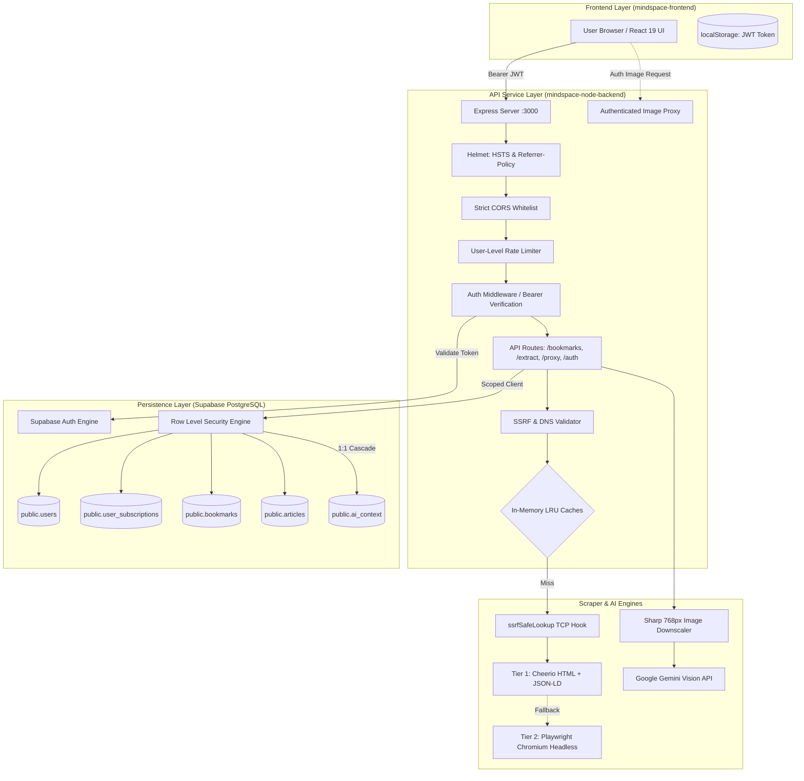
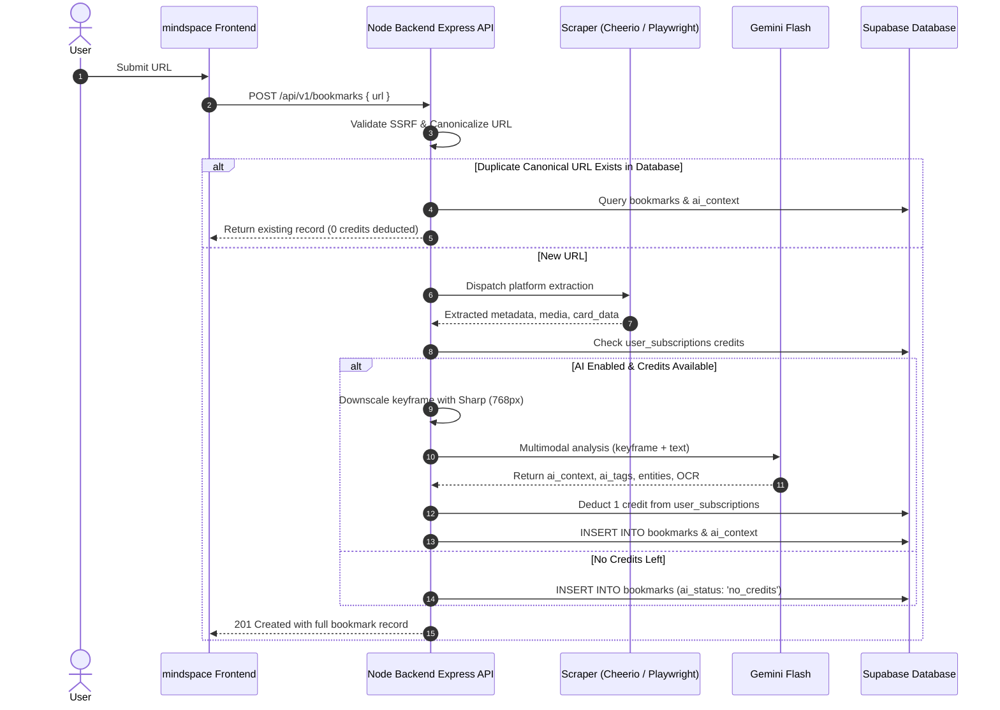
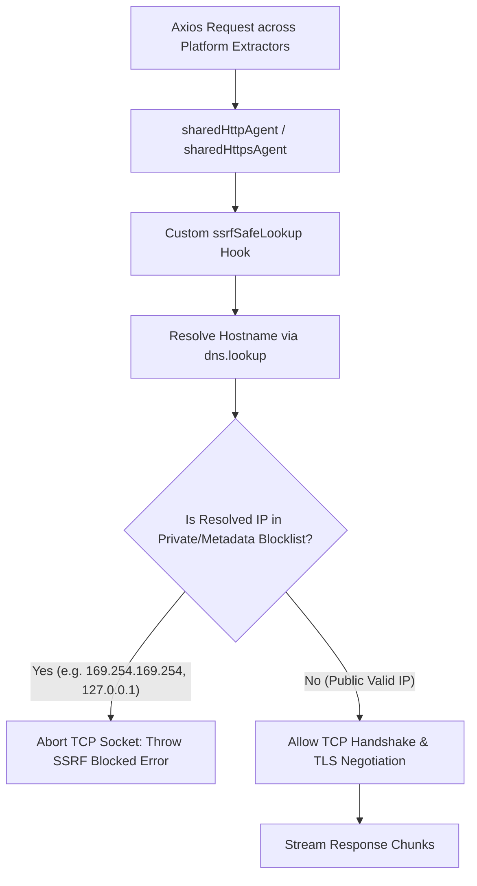

# Mindspace Node Backend (`mindspace-node-backend`)

> **Stateless, high-performance REST API powering automated metadata extraction, media streaming, enterprise SSRF defense, and Multimodal Gemini AI visual intelligence for Mindspace.**

Built with **Node.js**, **Express**, **TypeScript**, **Cheerio**, **Playwright**, and **Google Gemini Multimodal Vision API** (`@google/genai`).

> [!NOTE]
> **Complete Technical Documentation**: For exhaustive architectural specifications, full implementation history, API endpoint schemas, extractor strategies, and database setup, see [**`DETAILS.md`**](./DETAILS.md).

---

## 🚀 Key Features

* **Dual-Engine Scraping Architecture**: Sub-150ms static metadata parsing via Cheerio, falling back to an isolated headless Chromium instance via Playwright for JavaScript-rendered sites.
* **Platform-Native Strategy Extractors**: Dedicated extractors for Twitter/X, Instagram, LinkedIn, Reddit, YouTube, Facebook, and generic web articles with rich metric extraction and clean media resolution.
* **Full Article Extraction**: Automated main article extraction using Mozilla Readability with boilerplate stripping, formatted Markdown synthesis, word counts, and estimated reading time.
* **Multimodal Gemini AI Vision**: Google Gemini 2.5 / 3.x Flash visual intelligence generating contextual summaries, OCR text transcription, entity detection, and categorizing tags.
* **Single-Tile Image Compression**: Downscales candidate media to 768px progressive JPEG via Sharp, reducing payload sizes by up to 98% for sub-1.5s visual analysis.
* **Multi-Tier SSRF & Rebinding Protection**: Pre-validation of target URLs, re-validated DNS caching, Playwright subresource isolation, and raw TCP socket-level DNS interception (`ssrfSafeLookup`).
* **Tenant Isolation with Supabase RLS**: PostgreSQL Row Level Security strictly enforced via authenticated caller JWTs (`auth.uid() = user_id`).
* **Streaming Reverse Image Proxy**: Authenticated reverse proxy with client disconnect hooks, `maxRedirects: 0`, and content-type allowlisting to bypass anti-hotlinking CDN protections.
* **Deterministic Canonicalization & In-Memory LRU**: Multi-tier LRU caching for URL extractions, AI analyses, avatars, and DNS resolutions.

---

## 📊 Workflow & Architecture Diagrams

### 1. End-to-End System Topology


### 2. Bookmark Extraction & Multimodal AI Sequence


### 3. Socket-Level SSRF Pre-Connect Interception


---

## 🛡️ Security Checks & Hardening Controls

The following backend security controls have been audited and implemented:

| Category | Security Control | Threat / Vulnerability Mitigated | Implementation Detail | Status |
|---|---|---|---|:---:|
| **SSRF / TOCTOU** | **Socket-Level DNS Hook (`ssrfSafeLookup`)** | DNS Rebinding (TTL 0) & 302 Redirect TOCTOU to internal network / cloud metadata | Custom `lookup` hook in `sharedHttpAgent`/`sharedHttpsAgent` validates resolved IP directly before TCP socket handshake in `utils/httpClient.ts` | ✅ **Active** |
| **SSRF** | **IP-Revalidated DNS Cache** | DNS cache poisoning / rebinding window | `dnsCache` stores IP strings (`MemoryCache<string>`); every cache hit is re-verified via `isPrivateIP()` in `utils/ssrfValidator.ts` | ✅ **Active** |
| **Sandbox Security** | **Playwright Subresource Route Isolation** | Chromium SSRF targeting AWS/GCP metadata (`169.254.169.254`) or loopback | `page.route('**/*')` aborts any subresource requests targeting private IP ranges, localhost, or non-HTTP protocols in `services/playwrightEngine.ts` | ✅ **Active** |
| **Data Protection** | **Internal Error Sanitization** | Information leakage (table names, constraints, stack traces) via 500 status | Sanitized all 500 status responses in `bookmarkController.ts`, `extractController.ts`, and `aiController.ts` to return generic messages; logs kept server-side | ✅ **Active** |
| **Authentication** | **Password Complexity Enforcement** | Weak passwords & automated credential stuffing | `PASSWORD_REGEX` enforces uppercase, lowercase, digit, and min 8 chars on signup in `controllers/authController.ts` | ✅ **Active** |
| **Account Privacy** | **User Enumeration Defense** | Email harvesting via login, signup, and password reset responses | Constant generic responses returned for login failures (CWE-204), signup errors, and password reset requests in `controllers/authController.ts` | ✅ **Active** |
| **CORS Policy** | **Strict Origin Whitelisting** | Unauthorized cross-origin credentialed requests from rogue subdomains | Wildcards (`*.vercel.app`, `*.onrender.com`) replaced with exact production domains and scoped preview regex in `src/index.ts` | ✅ **Active** |
| **HTTP Headers** | **HSTS & Referrer-Policy** | Man-in-the-middle downgrade attacks & referer URL leaks | Helmet configured with 2-year HSTS (`maxAge: 63072000`, `includeSubDomains`, `preload`) and `strict-origin-when-cross-origin` in `src/index.ts` | ✅ **Active** |
| **Rate Limiting** | **User-Level & Heavy Scrape Throttling** | DoS, credential brute-forcing & Gemini/Playwright resource exhaustion | `authRateLimiter` (5/15m), `apiRateLimiter` (300/15m), and `heavyScrapingRateLimiter` (20/m) keyed by authenticated user ID (`userOrIpKey`) in `middleware/rateLimiter.ts` | ✅ **Active** |
| **Proxy Security** | **Authenticated Image Proxy with MIME Validation** | Open-proxy abuse, SSRF forwarding, and SVG stored XSS | Route protected by `authMiddleware`; enforces `maxRedirects: 0`, strict image MIME allowlist (SVG excluded), `nosniff`, and `CSP: default-src 'none'` in `controllers/proxyController.ts` | ✅ **Active** |
| **Tenant Isolation** | **RLS-Scoped Client Execution** | Cross-tenant data leakage / unauthorized DB operations | `getAuthenticatedSupabaseClient(token)` binds caller JWT + anon key for database interactions in `utils/supabaseClient.ts` | ✅ **Active** |
| **Diagnostics** | **Service Role Key Warning Upgrade** | Silent authorization degradation / missing admin privileges | Upgraded missing `SUPABASE_SERVICE_ROLE_KEY` logging from `warn` to `error` level in `utils/supabaseClient.ts` | ✅ **Active** |

---

## ⚡ Quick Start

```bash
# 1. Install dependencies & Playwright Chromium browser
npm install
npx playwright install chromium

# 2. Start local development server with hot-reload
npm run dev

# 3. Type check & production build
npx tsc --noEmit
npm run build

# 4. Start production server
npm start
```

For complete environment variable configuration, schema migration, and API endpoint references, please consult [**`DETAILS.md`**](./DETAILS.md).
