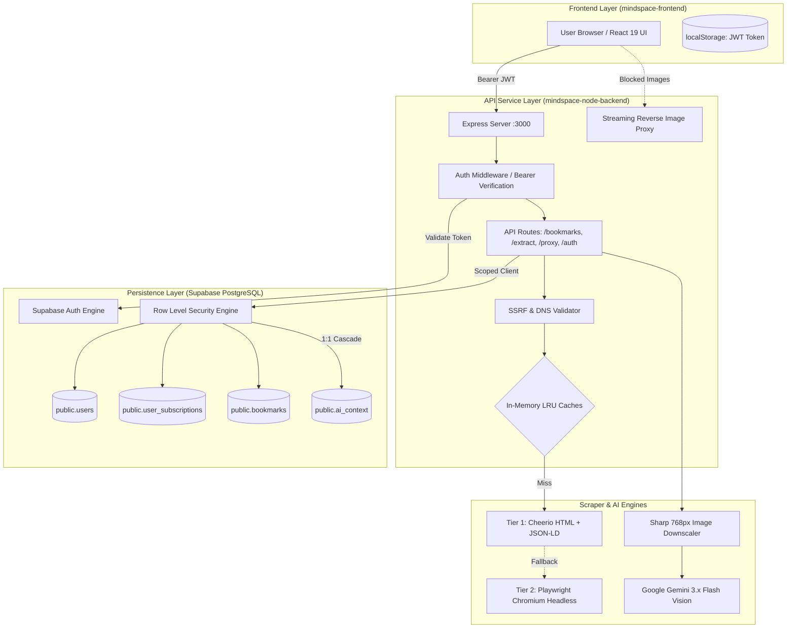
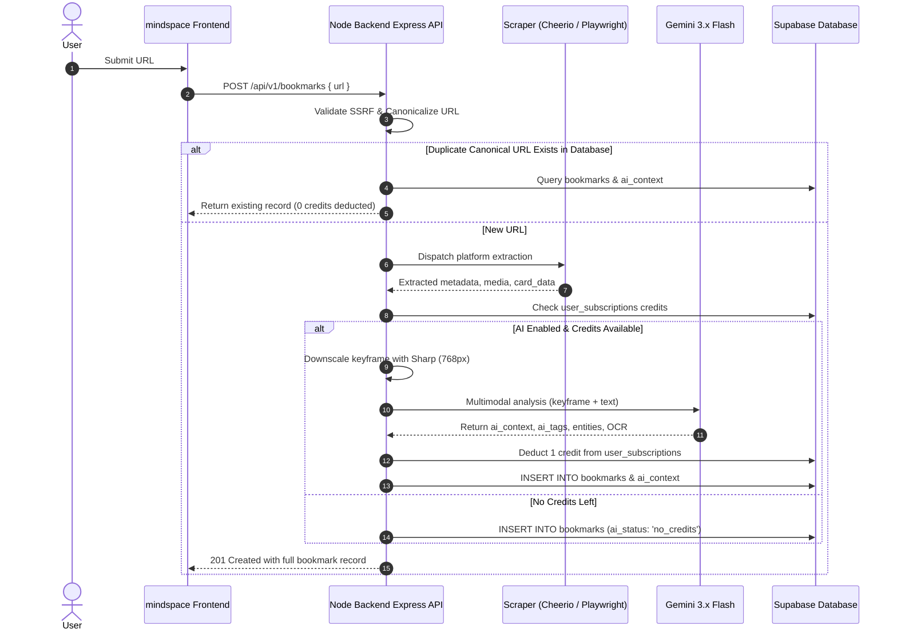

# Mindspace Node Backend (`mindspace-node-backend`)

A stateless, high-performance **REST API** built with **Node.js**, **Express**, **TypeScript**, **Cheerio**, **Playwright**, and **Google Gemini Multimodal Vision API** (`@google/genai`).

The service provides automated metadata extraction, media capture, anti-scraping and CDN hotlinking bypasses, user authentication, subscription quota gating, and deep multimodal visual intelligence on bookmarked links for **Mindspace**.

---

## Table of Contents

1. [System Architecture](#system-architecture)
2. [What Has Been Done Until Now](#what-has-been-done-until-now)
   - [1. Authentication, Sessions & RLS](#1-authentication-sessions--rls)
   - [2. Dual-Engine Scraping Pipeline](#2-dual-engine-scraping-pipeline)
   - [3. Platform-Specific Extractors](#3-platform-specific-extractors)
   - [4. Multimodal AI Visual & Video Intelligence](#4-multimodal-ai-visual--video-intelligence)
   - [5. Subscription Credit Quota & Rate Limits](#5-subscription-credit-quota--rate-limits)
   - [6. High-Performance In-Memory LRU Caching](#6-high-performance-in-memory-lru-caching)
   - [7. Global TCP Connection Pooling](#7-global-tcp-connection-pooling)
   - [8. Streaming Reverse Image Proxy Engine](#8-streaming-reverse-image-proxy-engine)
   - [9. Enterprise SSRF Protection & DNS Validation](#9-enterprise-ssrf-protection--dns-validation)
3. [Mermaid Architecture & Data Flow Diagrams](#mermaid-architecture--data-flow-diagrams)
   - [End-to-End System Topology](#end-to-end-system-topology)
   - [Bookmark Extraction & Multimodal AI Sequence](#bookmark-extraction--multimodal-ai-sequence)
4. [API Endpoints Reference](#api-endpoints-reference)
5. [Database Schema & Supabase Setup (`schema.sql`)](#database-schema--supabase-setup-schemasql)
6. [Project Structure](#project-structure)
7. [Environment Setup](#environment-setup)
8. [Commands & Scripts](#commands--scripts)

---

## System Architecture

Mindspace Backend is engineered around three core pillars: **Speed**, **Resilience**, and **Tenant Isolation**:

- **Fast-Path Metadata Extraction**: Lightweight static HTML ingestion via Axios & Cheerio (<150ms) before falling back to headless Chromium through Playwright (<2s).
- **Tenant Isolation with Supabase RLS**: All user data operations are bound to the caller's JWT token via `getAuthenticatedSupabaseClient(token)`, ensuring PostgreSQL strictly enforces `auth.uid() = user_id`.
- **Multimodal AI Vision Intelligence**: Google Gemini 3.x Flash models analyze downscaled keyframes, audio tracks, and full article prose to synthesize contextual summaries, OCR text, and AI tags.
- **DDoS & SSRF Defenses**: Target hostnames are validated against private, loopback, and link-local IP ranges before any network connection is established.

---

## What Has Been Done Until Now

### 1. Authentication, Sessions & RLS
- **Supabase Auth Gateway (`src/controllers/authController.ts`, `src/middleware/authMiddleware.ts`)**:
  - `POST /api/v1/auth/signup`: Registers new users in Supabase Auth, populates user metadata, and returns initial JWT.
  - `POST /api/v1/auth/login`: Authenticates user credentials and returns session tokens.
  - `GET /api/v1/auth/me`: Validates caller's Bearer token and returns active profile.
- **Bearer Token Middleware (`src/middleware/authMiddleware.ts`)**:
  - Validates tokens using `supabaseAdmin.auth.getUser(token)`.
  - Injects authenticated user object and a scoped Supabase client (`req.supabase`) directly into the request context.

### 2. Dual-Engine Scraping Pipeline
- **Tier 1 — Cheerio Scraper (`src/services/cheerioScraper.ts`)**:
  - Fetches static HTML in **<150ms** with custom desktop browser and crawler user-agents.
  - Parses OpenGraph (`og:*`), Twitter Cards (`twitter:*`), Schema.org JSON-LD, HTML5 semantic headings, meta descriptions, and touch icons.
  - **Full Article Extraction (`extractArticleContent`)**: Intelligently locates main article bodies (`article`, `[itemprop="articleBody"]`, `.post-content`, `main`), strips noise (ads, comments, sidebars), and outputs formatted Markdown with word counts and reading time.
- **Tier 2 — Playwright Chromium Headless Engine (`src/services/playwrightEngine.ts`)**:
  - Singleton browser instance with automatic recovery on crash or disconnect.
  - **Aggressive Resource Blocking**: Aborts stylesheets, fonts, images, media, websockets, and tracking scripts (Google Analytics, Hotjar, GTM, Clarity) at the network routing layer to maximize rendering speed and minimize RAM footprint.
  - Custom evaluation hooks, strict hydration timeouts (`domcontentloaded`), and clean process termination handlers (`SIGINT`, `SIGTERM`).

### 3. Platform-Specific Extractors
Each supported platform has a dedicated extractor strategy implementing `PlatformExtractor` (`src/services/extractors/`):

| Platform | File | Features Implemented |
| :--- | :--- | :--- |
| **Facebook** | `facebook.ts` | Mobile endpoints, crawler headers, Lookaside CDN resolver (`lookaside.fbsbx.com` -> `scontent.*.fbcdn.net`), post captions, multi-image carousel items, and parsed engagement metrics. |
| **Instagram** | `instagram.ts` | Parses Instagram embed HTML and structured JSON payloads, extracts clean captions, direct `.mp4` video streams, multi-image carousel sets, and author profile details. |
| **LinkedIn** | `linkedin.ts` | Scrapes LinkedIn JSON-LD metadata, filters generic ghost avatars, extracts post text, author headlines, article bodies, and reaction counts. |
| **Twitter / X** | `twitter.ts` | Multi-tier pipeline: FxTwitter API (`api.fxtwitter.com`), VxTwitter API, oEmbed syndication, and Playwright fallback for tweet text, media galleries, and metrics. |
| **Reddit** | `reddit.ts` | Queries Reddit JSON endpoints (`.json`), parses gallery data, video audio/playback streams, subreddit icons, author badges, and upvote metrics. |
| **YouTube** | `youtube.ts` | Extracts video IDs from standard URLs, shortlinks (`youtu.be`), embeds, and Shorts; queries YouTubei and oEmbed APIs for channel metadata, views, likes, and thumbnails. |
| **Global Web** | `globalWeb.ts` | Universal fallback for blogs, docs, and news sites with Google S2 favicon resolution, page intent classification, and article extraction. |

### 4. Multimodal AI Visual & Video Intelligence (`src/services/aiVisualService.ts`)
- **Powered by Google Gemini Multimodal Vision API (`@google/genai`)**:
  - Automatically submits media attachments and contextual metadata to Google's next-generation multimodal models.
  - **Candidate Model Chain & Circuit Breaker**:
    ```
    gemini-3.5-flash-lite → gemini-3.1-flash-lite → gemini-3.8-flash → gemini-3.7-flash → gemini-3.6-flash → gemini-3.5-flash
    ```
  - **In-Memory Quota Circuit Breaker (`exhaustedModels`)**:
    - If a model encounters quota exhaustion (`limit: 20`, `GenerateRequestsPerDay`, `RESOURCE_EXHAUSTED`, `quota exceeded`, `429`), it is added to `exhaustedModels` and instantly bypassed in future requests.
  - **Per-Model Fast Timeout (`AI_MODEL_TIMEOUT_MS`)**: Configurable timeout (default: `7000ms`). Stalled models abort and trigger immediate failover to the next candidate.
- **Ultra-Efficient In-Memory Image Compression (`sharp`)**:
  - **Single-Tile Optimization (Max 768px)**: Resizes candidate images to fit within 768×768 (Gemini's native single tile size) and converts to progressive JPEG (quality 70%).
  - **Drastic Payload Reduction**: Decreases base64 payloads from multi-MBs down to **20KB–50KB** (a **78% to 98% reduction**) while retaining crisp clarity for entity recognition and OCR.
- **Lightweight Video & Reel Processing (Keyframe + Text)**:
  - Extracts poster keyframes and pairs them with post captions and transcripts in under **1.5 seconds** at ~258 tokens instead of downloading heavy 15MB video files.
- **Anti-Hallucination Guardrails**:
  - Bypasses Gemini when login walls are detected (e.g. private Instagram/Facebook posts), returning clean fallback tags instead of consuming token quotas.

### 5. Subscription Credit Quota & Rate Limits (`src/services/subscriptionService.ts`)
- **Tier Quota Management**:
  - `free`: 6 AI credits per period with automatic weekly reset.
  - `pro`: Unlimited AI context generation.
- **Atomic Credit Deduction**:
  - `deductOneAiCredit()` is executed **only after** Gemini successfully generates a response, guaranteeing users are never billed for failed attempts or cached responses.
- **Canonical URL AI Deduplication**:
  - If any bookmark for the same canonical URL has already completed AI analysis across the database, the intelligence is reused with **0 Gemini calls and 0 credits deducted**.

### 6. High-Performance In-Memory LRU Caching (`src/utils/cache.ts`, `src/utils/urlFormatter.ts`)
- **Deterministic Canonicalization**:
  - Normalizes tracking query parameters (`utm_*`, `stkn`, `igsh`, `fbclid`, `gclid`, `s=20`, `si`), path variations (`/reels/` vs `/reel/`), and hostnames.
- **Zero-Dependency LRU Cache Instances**:
  - `extractionCache`: 30-minute TTL (1,000 entries) for sub-millisecond repeated URL extractions.
  - `aiCache`: 1-hour TTL (500 entries) for multimodal Gemini analyses.
  - `avatarCache`: 2-hour TTL (500 entries) for external author/channel avatars.
  - `dnsCache`: 5-minute TTL (500 entries) for validated SSRF IP resolutions.

### 7. Global TCP Connection Pooling (`src/utils/httpClient.ts`)
- Configured shared `http.Agent` and `https.Agent` with `keepAlive: true`, 64 max sockets, and 32 free sockets globally bound to Axios.
- Reuses established TCP/TLS connections across consecutive requests, eliminating **50–150ms** of SSL handshake latency per scrape.

### 8. Streaming Reverse Image Proxy Engine (`src/controllers/proxyController.ts` & `/api/v1/proxy-image`)
- Proxies media requests using a crawler user-agent (`facebookexternalhit/1.1`) to bypass CDN hotlinking blocks and CORS restrictions (e.g. Meta CDN `fbcdn.net` / `scontent` 403 Forbidden errors).
- **Streaming Pipeline**: Pipes upstream image chunks directly into the client response without buffering full files into server memory.
- **Aggressive Caching**: Injects `Cache-Control: public, max-age=86400, stale-while-revalidate=604800` (24-hour browser cache, 7-day CDN stale-while-revalidate).
- **Client Disconnect Handling**: Destroys upstream streams immediately if the client disconnects.

### 9. Enterprise SSRF Protection & DNS Validation (`src/utils/ssrfValidator.ts`)
- Resolves target hostnames before sending requests.
- Blocks internal, loopback, private, and link-local ranges:
  - `127.0.0.0/8` (Loopback)
  - `10.0.0.0/8`, `172.16.0.0/12`, `192.168.0.0/16` (Private RFC 1918)
  - `169.254.0.0/16` (Link-Local & Cloud Metadata e.g. AWS/GCP `169.254.169.254`)
  - `0.0.0.0/8` (Current network)
  - `::1`, `fc00::/7`, `fe80::/10` (IPv6 loopback & private)
- Rejects `localhost`, `.local`, and `.internal` hostnames.

---

## Mermaid Architecture & Data Flow Diagrams

### End-to-End System Topology



### Bookmark Extraction & Multimodal AI Sequence



---

## API Endpoints Reference

### Authentication Endpoints

- **`POST /api/v1/auth/signup`**: Registers user in Supabase Auth.
  - Body: `{ "email": "user@example.com", "password": "securepassword", "username": "abhi" }`
- **`POST /api/v1/auth/login`**: Authenticates user credentials.
  - Body: `{ "email": "user@example.com", "password": "securepassword" }`
- **`GET /api/v1/auth/me`**: Returns profile of authenticated caller.
  - Headers: `Authorization: Bearer <token>`

### Bookmark Endpoints (Authenticated)

- **`GET /api/v1/bookmarks`**: Lists all bookmarks for the authenticated user, joined with AI context.
- **`POST /api/v1/bookmarks`**: Creates a bookmark, scrapes metadata, checks user credits, runs Gemini AI, and persists directly into Supabase.
  - Body: `{ "url": "https://...", "auto_ai_context": true }`
- **`POST /api/v1/bookmarks/:id/generate-ai`**: Triggers manual AI context generation for an existing bookmark. Deducts 1 credit on success.
- **`DELETE /api/v1/bookmarks/:id`**: Removes bookmark and cascades deletion to `ai_context`.

### User & Quota Endpoints (Authenticated)

- **`GET /api/v1/user/plan`**: Returns current plan tier (`free` / `pro`), remaining AI credits, and reset timestamp.
- **`PATCH /api/v1/user/settings`**: Updates preferences (e.g. `{ "auto_ai_context": false }`).

### Utility Endpoints

- **`POST /api/v1/extract`**: Stateless metadata extraction with optional AI analysis.
- **`POST /api/v1/ai-analyze`**: Standalone multimodal visual intelligence analysis.
- **`GET /api/v1/proxy-image?url=ENCODED_IMAGE_URL`**: High-performance reverse image proxy bypassing hotlink blocks.
- **`GET /health`**: Health status and ISO timestamp.

---

## Database Schema & Supabase Setup (`schema.sql`)

The repository includes a complete PostgreSQL schema script in [`schema.sql`](file:///c:/Users/abhi/Documents/mindspace/mindspace-node-backend/schema.sql) ready to be executed in the **Supabase SQL Editor**:

1. Open your project on the [Supabase Dashboard](https://supabase.com/dashboard).
2. Navigate to the **SQL Editor** tab on the left sidebar.
3. Copy the entire contents of [`mindspace-node-backend/schema.sql`](file:///c:/Users/abhi/Documents/mindspace/mindspace-node-backend/schema.sql).
4. Paste it into the editor and click **Run**.

---

## Project Structure

```
mindspace-node-backend/
├── src/
│   ├── controllers/
│   │   ├── aiController.ts         # Controller for /api/v1/ai-analyze
│   │   ├── authController.ts       # Controller for /api/v1/auth (signup, login, me)
│   │   ├── bookmarkController.ts   # Controller for /api/v1/bookmarks & user plan
│   │   ├── extractController.ts    # Controller for /api/v1/extract
│   │   └── proxyController.ts      # Controller for /api/v1/proxy-image
│   ├── middleware/
│   │   └── authMiddleware.ts       # Bearer token validator & RLS client injector
│   ├── routes/
│   │   ├── auth.ts                 # Authentication routes
│   │   ├── bookmarks.ts            # Bookmark CRUD and user plan routes
│   │   ├── extract.ts              # Extraction & AI routes
│   │   └── proxy.ts                # Image proxy route
│   ├── services/
│   │   ├── extractors/
│   │   │   ├── facebook.ts         # Facebook multi-tier extractor
│   │   │   ├── globalWeb.ts        # Generic website fallback extractor
│   │   │   ├── index.ts            # Extractor router & caching dispatcher
│   │   │   ├── instagram.ts        # Instagram embed & JSON extractor
│   │   │   ├── linkedin.ts         # LinkedIn JSON-LD extractor
│   │   │   ├── reddit.ts           # Reddit JSON API extractor
│   │   │   ├── twitter.ts          # Twitter / FxTwitter API extractor
│   │   │   ├── types.ts            # Common extractor TypeScript interfaces
│   │   │   └── youtube.ts          # YouTube oEmbed & channel extractor
│   │   ├── aiVisualService.ts      # Multimodal Gemini vision & fallback service
│   │   ├── cheerioScraper.ts       # Fast static HTML & Markdown article scraper
│   │   ├── playwrightEngine.ts     # Chromium headless browser manager
│   │   └── subscriptionService.ts  # Tier credit allocation & quota deduction
│   ├── utils/
│   │   ├── cache.ts                # In-memory LRU cache implementations
│   │   ├── httpClient.ts           # Axios TCP keep-alive connection pooling
│   │   ├── logger.ts               # Structured timestamped logger
│   │   ├── numberParser.ts         # Formatted number parser (e.g. 1.2K -> 1200)
│   │   ├── siteName.ts             # Domain & site name resolver
│   │   ├── ssrfValidator.ts        # SSRF IP resolution defense
│   │   ├── supabaseClient.ts       # Supabase admin and RLS client factories
│   │   ├── textCleaner.ts          # HTML entity & whitespace cleaner
│   │   └── urlFormatter.ts         # Absolute URL resolver & canonicalizer
│   └── index.ts                    # Express app initialization & shutdown hooks
├── schema.sql                      # PostgreSQL database schema & RLS policies
├── package.json
├── tsconfig.json
└── .env.example
```

---

## Environment Setup

Create a `.env` file in `mindspace-node-backend/`:

```env
PORT=3000

# Google Gemini Multimodal Vision API Key
GEMINI_API_KEY=your_gemini_api_key_here
ENABLE_AI_VISUAL=true
AI_MODEL_TIMEOUT_MS=7000

# Supabase Configuration
SUPABASE_URL=https://your-project.supabase.co
SUPABASE_SERVICE_ROLE_KEY=your-service-role-key-here
SUPABASE_ANON_KEY=your-anon-key-here

# Logging
LOG_LEVEL=info
```

---

## Commands & Scripts

### Prerequisites
- Node.js (v18+)
- Playwright Chromium browser (`npx playwright install chromium`)

### Installation
```bash
npm install
npx playwright install chromium
```

### Development Server (with Hot Reload)
```bash
npm run dev
```

### Compile TypeScript
```bash
npm run build
```

### Run Production Server
```bash
npm start
```
